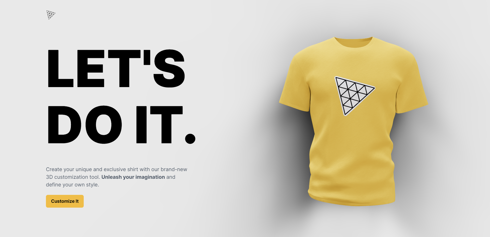
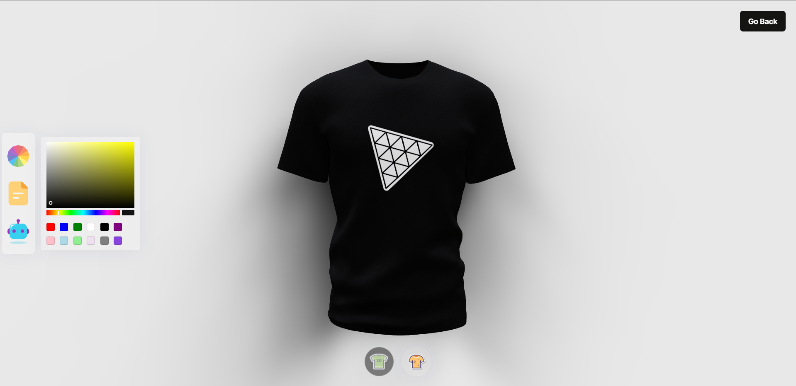
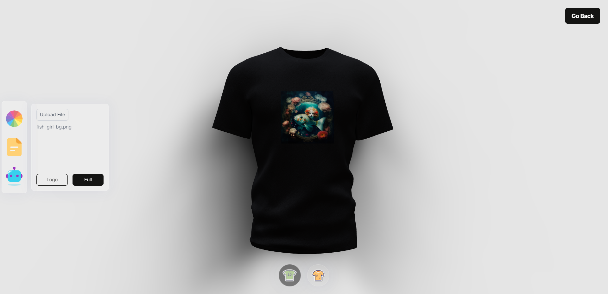
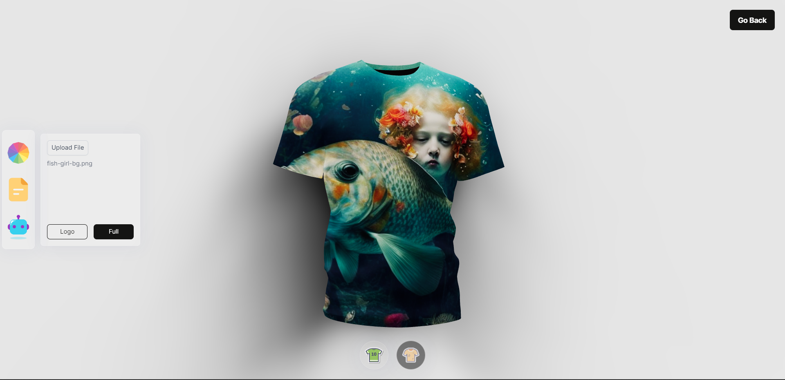
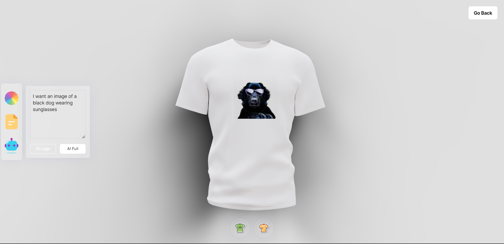

<h1 align="center"> 3D SHIRT CUSTOMIZER</h1>

## 💻 PROJECT
This is a <strong>3D Shirt Customizer</strong> powered by AI, where you can select the color you want, can select a picture as a logo or as full texture of the shirt, you also can ask AI to generate any specific image that you want.

Want to check the project live? [Click Here!](https://3d-shirt-customizer.netlify.app/)  
<strong>Note: AI might take a while to generate your first image.</strong>

    
    
    
    
    

## 🚀 Techs
This project was developed using the following technologies 
Vite 
ReactJs 
React Color 
React Router Dom 
Threejs 
maath 
valtio 
Tailwindcss 
Framer Motion

## 🚀 Credits
JSMastery - https://www.youtube.com/watch?v=ezv5Zkm67D0&t=1005s

                                              
